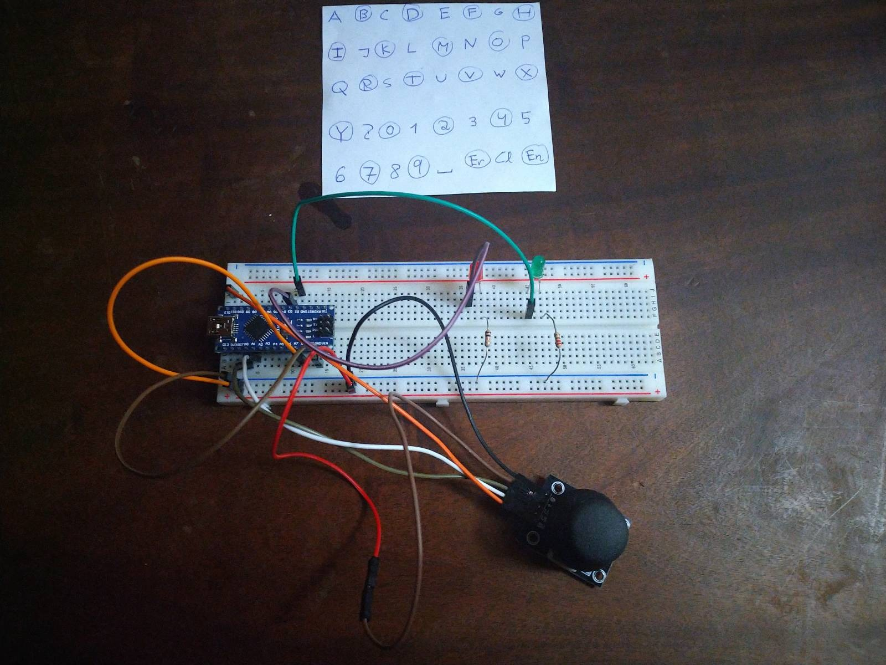
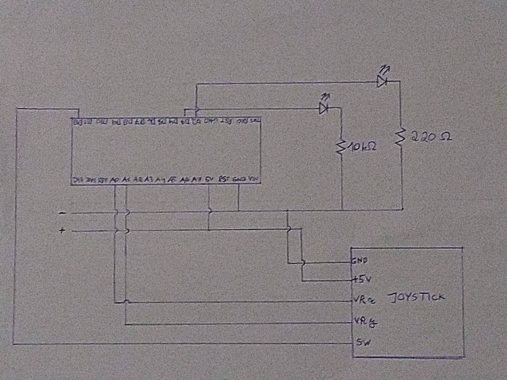

# Morse code message sender

## Functionality

This Arduino project lets the user send messages in Morse code via selection of text characters, by iterating through a table with them. Those characters are:

* The ASCII letters
* The cardinal numbers
* The Space character
* Placeholder characters for giving instructions: Erase character, Clear text, Send message

## Implementation

The user moves a joystick and presses it to select each character. Since there is no display, one of the LEDs blinks on/off depending on the preselected letter, according to a chess pattern. The other LED is the main one, and blinks according to the message itself.

The following components were used:

* 1 Arduino Nano
* 1 Joystick
* 2 LEDs
* 1 220Ω Resistor
* 1 1kΩ Resistor

## Read More

https://github.com/HackerSchool/recrutamento-22-23-s1/tree/main/digital-eletronics
