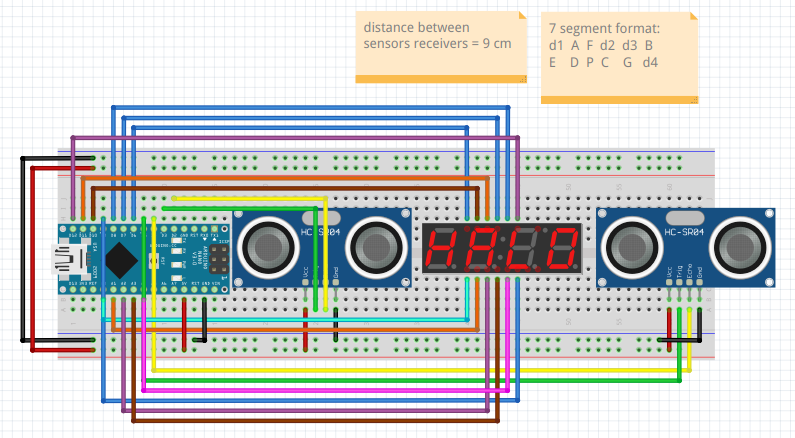

## HackerSchool Eletronics Project 2022

Calculates object velocity (in `m/s`) from sensor A to sensor B.

[Schematic](./schematic.fzz) was done using [Fritzing](https://fritzing.org/) software.

## Dependencies
- [SevSeg](https://github.com/DeanIsMe/SevSeg) : Seven segment display controller library for Arduino

*maybe a bit simple/messy/buggy, i hate cables !*